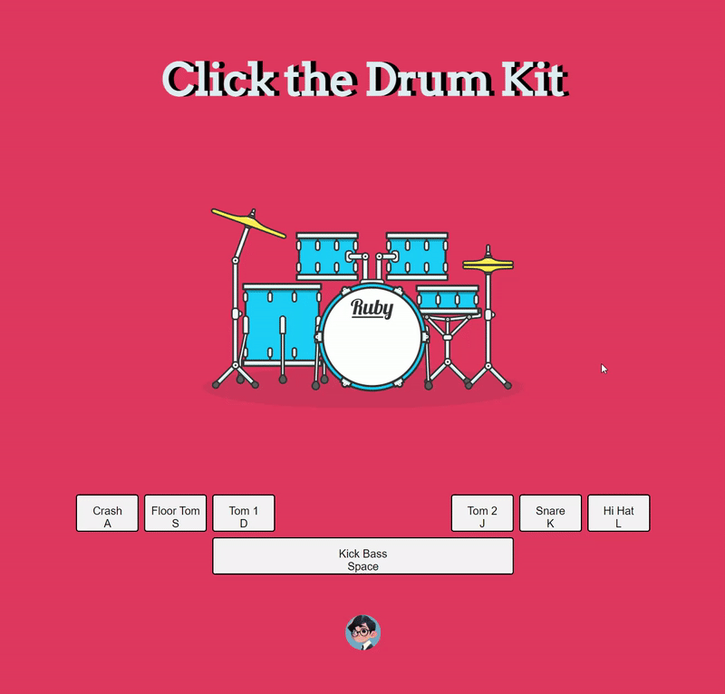

# Project: Drum-it
Project for Day 18 of Udemy 2023 Web Development Bootcamp: A simple, fully responsive, fully interactive, fun drum set webset where you can hear different drum kit! Play it by either press the physical keyboard or click on-screen keys or simply click on the different part of drum image!
[Try it out](https://jaycka.github.io/dicee-it/)  
___  
**Concepts and skills used in this project:**  
`HTML` | `CSS` | `JavaScript` | `DOM` | `Higher Order Function` | `CallBack Function`
___
**Features:**  
* Listen to physical keyboard press;
* Listen to on-screen key clicks;  
* Listen to on-screen key clicks on different part of drum images;
* Play sound accordingly;
___  
**Demo**  

